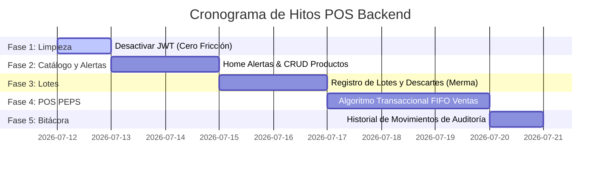

# Hoja de Ruta de Refactorización Final - Backend StockMin

Esta hoja de ruta detalla de manera estructurada e incremental las fases y tareas necesarias para refactorizar el backend de la aplicación **StockMin** (Minimarket "Todo Dar"). Esta refactorización adapta las rutas y controladores al nuevo esquema físico relacional de PostgreSQL (vía Prisma ORM) para soportar el Punto de Venta (POS) con gestión de lotes, control de mermas, venta inteligente PEPS y auditoría automática sin autenticación JWT (**Cero Fricción**).

El contrato de comunicación y especificación de endpoints detallado se encuentra en:
👉 [docs/api_contract_v2.md](file:///c:/Proyectos/Universidad/Ciclo_8/StockMin-Backend/docs/api_contract_v2.md)

---

## 🏗️ Resumen del Modelo Físico en Refactorización
*   **Catálogo de Productos (`Producto`):** Almacena únicamente metadatos comerciales y precio base. El stock estático ha sido eliminado; ahora se calcula dinámicamente.
*   **Inventario Físico (`Lote`):** Controla las existencias en almacén por fecha de ingreso y fecha de vencimiento.
*   **Punto de Venta POS (`Venta` / `DetalleVenta`):** Registra las ventas y congela el precio histórico de venta del ítem.
*   **Auditoría (`Movimiento`):** Bitácora autónoma que registra logs legibles de operaciones sin dependencia jerárquica con usuarios.

---

## 🛠️ Fases de la Refactorización del Backend

### Fase 1: Limpieza de Rutas y Modo "Cero Fricción" 🔓
Desactivar la protección de tokens JWT en las rutas de negocio para facilitar el testeo rápido con Postman.

- [ ] **1.1. Desactivación de Middlewares JWT:**
  - Comentar o eliminar el uso del middleware `authenticateToken` en los archivos de rutas de productos y movimientos.
  - Asegurar que todos los endpoints respondan de forma pública temporalmente.
- [ ] **1.2. Habilitación de Nuevos Enrutadores:**
  - En `src/app.js`, registrar los prefijos `/api/lotes` y `/api/ventas`.

---

### Fase 2: Módulo de Catálogo y Alertas Dinámicas 📦
Modificar la lógica de productos para trabajar con el stock calculado e implementar el panel del Home.

- [ ] **2.1. Lista de Productos (`GET /api/productos`):**
  - Consultar productos incluyendo sus lotes activos (`cantidadDisponible > 0`).
  - Calcular e inyectar dinámicamente el campo `stock` como la suma de la disponibilidad de todos sus lotes.
- [ ] **2.2. Búsqueda por Escáner (`GET /api/productos/barcode/:barcode`):**
  - Buscar un producto por código de barras. Retornar su información comercial junto con el stock total consolidado.
- [ ] **2.3. Endpoint Crítico de Alertas del Home (`GET /api/productos/alertas`):**
  - **Lógica de Alertas de Vencimiento:** Buscar lotes activos cuya `fechaVencimiento` esté a 7 días o menos de la fecha actual (calcular diferencia de tiempo).
  - **Lógica de Alertas de Stock Mínimo:** Buscar productos cuyo stock consolidado (suma de lotes) sea menor o igual a su `stockMinimo`.
- [ ] **2.4. Creación de Producto (`POST /api/productos`):**
  - Adaptar para registrar el catálogo en `Producto` con stock inicial por defecto en `0` (el stock se ingresará a través del módulo de Lotes).

---

### Fase 3: Módulo de Lotes e Ingreso de Mercancía 🗄️
Implementar la gestión física de lotes y el descarte por mermas.

- [ ] **3.1. Crear Enrutador de Lotes (`src/routes/lot.routes.js`):**
  - Crear archivo y registrar endpoints para el módulo de lotes.
- [ ] **3.2. Registro de Ingresos (`POST /api/lotes`):**
  - Recibir `productoId`, `cantidadDisponible` y `fechaVencimiento` (opcional).
  - Crear el lote e insertar de forma transaccional un registro en `Movimiento` con `tipo: "INGRESO_LOTE"` y descripción detallada en español (ej: *"Ingreso de lote de Leche Gloria Azul (x20). Vence: 15/09/2026"*).
- [ ] **3.3. Control de Descartes (`POST /api/lotes/:id/merma`):**
  - Recibir la cantidad de merma a dar de baja.
  - Actualizar el lote restando de su `cantidadDisponible`.
  - Crear transaccionalmente un registro en `Movimiento` con `tipo: "MERMA"` y descripción detallada de la baja en español.

---

### Fase 4: Punto de Venta POS y Algoritmo PEPS/FIFO 🛒
Implementar la lógica transaccional de ventas descontando stock de manera inteligente.

- [ ] **4.1. Crear Enrutador de Ventas (`src/routes/sale.routes.js`):**
  - Registrar ruta de cobro `POST /api/ventas`.
- [ ] **4.2. Algoritmo Transaccional PEPS (Lógica Oculta):**
  - Envolver la creación de la venta en una transacción interactiva de Prisma (`prisma.$transaction`).
  - Para cada ítem del carrito (`productoId`, `cantidadVendida`):
    1.  Verificar que el stock consolidado total sea suficiente. Si es insuficiente, lanzar excepción para realizar rollback.
    2.  Consultar lotes con disponibilidad mayor a `0` ordenados por `fechaVencimiento ASC` (los que expiran antes se consumen primero) y en segundo término por `fechaIngreso ASC` (desempate).
    3.  Consumir la cantidad restando secuencialmente de cada lote hasta cubrir la demanda total del producto.
    4.  Crear `DetalleVenta` congelando el `precioBase` actual del producto en la columna `precioUnitarioCongelado`.
- [ ] **4.3. Cierre de Ticket y Auditoría:**
  - Crear la cabecera `Venta` con el total de venta cobrado.
  - Insertar automáticamente en la tabla `Movimiento` un registro de `tipo: "VENTA"` con el resumen detallado del ticket de compra en español.

---

### Fase 5: Bitácora de Auditoría Consolidada 📜
- [ ] **5.1. Listado de Auditoría (`GET /api/movimientos`):**
  - Listar los registros de la tabla `Movimiento` ordenados cronológicamente por `fecha DESC`.
  - Soportar filtrado por query string `?tipo=...` para aislar ingresos, ventas o mermas.

---

## 📅 Diagrama de Hitos e Integración

